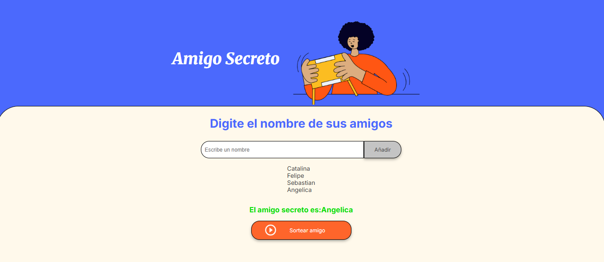

# 🎉 Amigo Secreto - Juego en JavaScript

Este es un pequeño juego web para realizar un sorteo de Amigo Secreto. Permite ingresar nombres, almacenarlos en una lista y seleccionar uno al azar con solo presionar un botón.

## 🚀 Características

- Agregar nombres a una lista.
- Validación para evitar entradas vacías.
- Mostrar la lista de nombres ingresados.
- Seleccionar un nombre aleatoriamente como Amigo Secreto.
- Interfaz sencilla y fácil de usar.

## 📸 Captura de Pantalla

